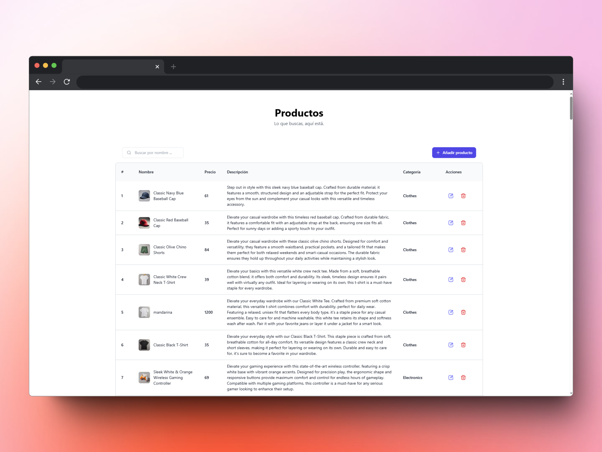

# Platzi App CRUD
## [Ver Demo 👀](https://platzi-app-crud.vercel.app/)
Este proyecto es una aplicación CRUD (Crear, Leer, Actualizar y Eliminar) desarrollada con Angular. Fue creado como un ejemplo práctico para aprender y demostrar el uso de Angular junto con TailwindCSS.

## Características

- **Framework**: Angular (v18.1.0)
- **Estilos**: TailwindCSS
- **Herramientas de desarrollo**:
  - TypeScript
- Funcionalidades principales:
  - Operaciones CRUD
  - Componentes modulares
  - Servicios para interacción con APIs

## Requisitos previos

- Node.js (versión 16+ recomendada)
- Angular CLI instalado globalmente
  ```bash
  npm install -g @angular/cli
  ```

## Estructura del proyecto
```bash
platzi-app-crud/
├── src/
│   ├── app/
│   │   ├── core/           # Interfaces y servicios principales
│   │   ├── modules/        # Componentes modulares (CRUD, notificaciones, búsqueda, etc.)
│   │   └── shared/         # Componentes compartidos (pie de página, encabezados, etc.)
│   ├── environments/       # Configuraciones de entorno
│   ├── index.html          # Archivo principal de HTML
│   └── styles.css          # Estilos globales
├── angular.json            # Configuración del proyecto Angular
├── package.json            # Dependencias y scripts
└── tailwind.config.js      # Configuración de TailwindCSS
```

## Pantalla 💡
